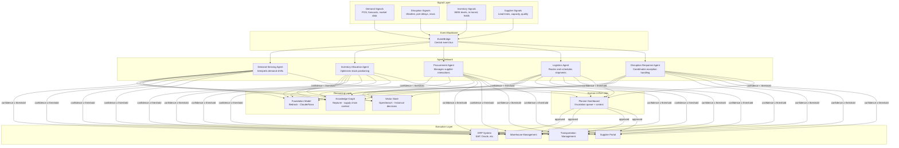
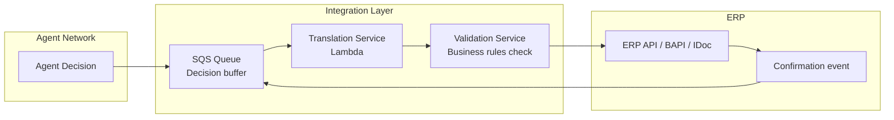

# Agentic Supply Chain Optimization — Architecture

## System Overview



## Agent Taxonomy

Each agent owns a specific decision domain. Agents do not share responsibilities. If a decision spans two domains, the upstream agent emits an event that the downstream agent consumes.

### 1. Demand Sensing Agent

**Responsibility:** Detect demand shifts earlier than statistical models alone can capture.

**Inputs:**

- POS data (batch, 4-hour refresh from retailer EDI feeds\

\Social media signal scores (real-time, from pre-trained sentiment classifiers\

\Weather forecasts (daily, regional\

\Promotional calendar (weekly updates from trade marketing\

\Competitor pricing signals (daily scrapes, where legally permitted)

**Outputs:**

- Demand adjustment signals (per SKU-location, published to EventBridge\

\Confidence score (0.0 to 1.0\

\Reasoning trace (natural language explanation of why the adjustment was made)

**Foundation Model Use:**

- Synthesizing unstructured signals (news articles about ingredient shortages, social trends) into structured demand impact assessment\

\Generating human-readable explanations for planners when escalation occurs

**Decision Boundary:**

- Can adjust demand forecasts by up to +/- 15% without human approva\

\Adjustments beyond 15% route to demand planning team with full context

---

### 2. Inventory Allocation Agent

**Responsibility:** Determine optimal stock positioning across distribution network.

**Inputs:**

- Current inventory levels by DC and store (real-time from WMS\

\Demand adjustment signals from Demand Sensing Agen\

\Inbound shipment ETAs from Logistics Agen\

\Shelf-life constraints (from product master data\

\Service level targets by channel (from commercial agreements)

**Outputs:**

- Transfer orders between DC\

\Allocation priorities when stock is constraine\

\Pre-positioning recommendations ahead of anticipated demand events

**Foundation Model Use:**

- Reasoning about trade-offs when multiple constraints conflict (e.g., freshness vs. fill rate vs. transportation cost\

\Generating scenario comparisons for planner review during constrained periods

**Decision Boundary:**

- Can execute transfers below $50K value automaticall\

\Transfers above $50K or cross-region movements require planner approva\

\Any allocation that would breach a contractual service level escalates immediately

---

### 3. Procurement Agent

**Responsibility:** Manage supplier ordering, negotiate quantities, and respond to supply disruptions.

**Inputs:**

- Inventory depletion forecasts from Allocation Agen\

\Supplier capacity and lead time data (from SRM portal\

\Contract terms and pricing tiers (from procurement system\

\Quality incident history (from QA database)

**Outputs:**

- Purchase order recommendation\

\Supplier communication drafts (for human review before sending\

\Alternative sourcing recommendations when primary supplier is constrained

**Foundation Model Use:**

- Drafting supplier communications (expedite requests, quantity change notifications\

\Analyzing supplier risk signals from news and financial filing\

\Recommending alternative suppliers based on historical performance similarity

**Decision Boundary:**

- Can place POs within contracted terms and existing approved supplier list automaticall\

\New suppliers, off-contract pricing, or POs above $200K require procurement manager approva\

\All external communications route through human review before sending

---

### 4. Logistics Agent

**Responsibility:** Optimize transportation routing, carrier selection, and delivery scheduling.

**Inputs:**

- Transfer orders from Allocation Agen\

\Carrier rate cards and capacity (from TMS\

\Real-time traffic and weather condition\

\Delivery window requirements from customer order\

\Port and terminal congestion data

**Outputs:**

- Carrier assignments and route selection\

\Shipment consolidation recommendation\

\ETA updates propagated to downstream agents

**Foundation Model Use:**

- Reasoning about multi-modal trade-offs (cost vs. speed vs. carbon\

\Interpreting unstructured disruption reports (port closures, road incidents) into actionable routing changes

**Decision Boundary:**

- Can select carriers and routes within budgeted lane rates automaticall\

\Expedited shipping (above standard cost by 20%+) requires logistics manager approva\

\Mode changes (e.g., switching from ocean to air) always escalate

---

### 5. Disruption Response Agent

**Responsibility:** Coordinate cross-domain response when a material disruption occurs.

**Inputs:**

- Disruption events (weather, geopolitical, supplier failure, quality recall\

\Current state from all other agent\

\Historical disruption response playbooks (from vector store)

**Outputs:**

- Coordinated response plan (which agents need to take which actions\

\Impact assessment (revenue at risk, customer impact, timeline\

\Executive summary for leadership communication

**Foundation Model Use:**

- This agent relies most heavily on foundation models. Its entire job is reasoning under uncertainty across multiple domains\

\Retrieves similar historical disruptions from vector store and adapts past playbooks to current condition\

\Generates executive-ready impact summaries

**Decision Boundary:**

- Can trigger coordinated responses valued below $500K total impac\

\Any response plan affecting customer commitments or exceeding $500K escalates to VP-level supply chain leadership with full context package

---

## Event Schema

All inter-agent communication flows through EventBridge using a standard envelope:

```json
{
  "source": "supply-chain.agent.demand-sensing",
  "detail-type": "DemandAdjustment",
  "detail": {
    "agent_id": "demand-sensing-prod-01",
    "timestamp": "2026-06-15T14:32:00Z",
    "decision_id": "d-2026-06-15-001847",
    "confidence": 0.82,
    "payload": {
      "sku": "SKU-4471-OATMILK-32OZ",
      "location_id": "DC-CHI-01",
      "adjustment_pct": 12.4,
      "adjustment_direction": "increase",
      "valid_through": "2026-06-22T00:00:00Z"
    },
    "reasoning_trace": "Social media spike detected for oat milk category in Chicago metro. Correlated with local influencer campaign launching June 16. Historical pattern match (87% similarity) to Q3-2025 event that drove 14% demand increase over 5 days.",
    "escalation_required": false
  }
}
```

## Integration with Legacy ERP

Most CPG enterprises run SAP S/4HANA, Oracle EBS, or JDE. Agents do not call ERP APIs directly. Instead, an integration layer translates agent decisions into ERP-native transactions.



**Why this pattern:**

- **Buffered execution:** Decisions queue in SQS, allowing for batching and rate limiting against ERP API quota\

\**Translation isolation:** Agent decision format never couples to ERP-specific schemas. When the ERP changes (or is replaced), only the translation service changes\

\**Validation gate:** Business rules that cannot be encoded in agent guardrails (e.g., fiscal period locks, approval matrix edge cases) get a final check before ERP executio\

\**Confirmation loop:** ERP confirms or rejects. Rejections route back to the agent for replanning.

## Guardrails and Safety

| Layer | Mechanism | Purpose |
|---|---|---|
| Agent-level | Confidence threshold per decision type | Prevents autonomous execution when the model is uncertain |
| System-level | Maximum daily autonomous spend cap | Limits blast radius of systematic errors |
| Domain-level | Hard constraints from business rules engine | Enforces non-negotiable policies (contractual minimums, regulatory holds) |
| Human-level | Escalation queue with 4-hour SLA | Ensures decisions don't stall indefinitely waiting for human input |
| Audit-level | Every decision logged with full reasoning trace | Complete auditability for compliance and continuous improvement |

## Cost Model

Estimated monthly cost at scale (enterprise with 5,000 SKUs across 12 DCs, processing ~50,000 decisions/day):

| Component | Monthly Cost | Notes |
|---|---|---|
| EventBridge | $150 | ~1.5M events/month |
| Bedrock (Claude Sonnet) | $8,000 - $12,000 | ~200K inference calls/month, avg 2K input + 500 output tokens |
| OpenSearch (vector store) | $2,400 | 3-node cluster, r6g.large |
| Neptune (knowledge graph) | $1,800 | db.r6g.large, single instance |
| Lambda (integration + translation) | $400 | ~5M invocations/month |
| SQS | $50 | ~10M messages/month |
| Step Functions | $600 | Orchestration for multi-step escalation flows |
| CloudWatch + logging | $300 | Metrics, alarms, log retention |
| **Total** | **$13,700 - $17,700/month** | |

**Break-even analysis:** A single prevented stockout at a major retailer (lost sales + penalty fees) typically costs $50K-$500K depending on product and retailer. One disruption response that avoids expedited air freight can save $200K+. The system pays for itself if it prevents one material incident per quarter.

## Implementation Sequence

Do not build all five agents simultaneously. Recommended rollout:

1. **Month 1-2:** Demand Sensing Agent (highest signal value, lowest integration risk)
2. **Month 3-4:** Inventory Allocation Agent (builds on demand signals, requires WMS integration)
3. **Month 5-6:** Disruption Response Agent (coordinates across existing agents, highest reasoning complexity)
4. **Month 7-8:** Procurement Agent (requires SRM integration, external communication review process)
5. **Month 9-10:** Logistics Agent (requires TMS integration, carrier API connections)

Each agent launches in shadow mode first (recommendations only, no autonomous execution) for 4-6 weeks before confidence thresholds are calibrated and autonomy is enabled.
