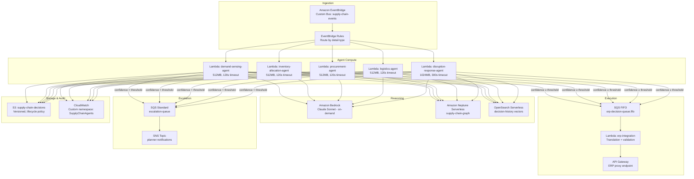

# Agentic Supply Chain — AWS Implementation Guide

Production-ready deployment using AWS-native services. This guide translates the [architecture patterns](../architecture.md) into deployable infrastructure with CDK, explicit IAM policies, and operational runbooks.

## Service Map

| Architecture Component | AWS Service | Configuration |
|---|---|---|
| Event Backbone | Amazon EventBridge | Custom event bus, 5 rules, DLQ attached |
| Agent Runtime | AWS Lambda + Amazon Bedrock | One function per agent, Bedrock invoke permissions |
| Agent Orchestration | AWS Step Functions | Per-agent state machine for multi-step reasoning |
| Knowledge Graph | Amazon Neptune Serverless | Graph database for supply chain entity relationships |
| Vector Store | Amazon OpenSearch Serverless | Vector search collection for historical decisions |
| Decision Buffer | Amazon SQS | FIFO queues between agents and ERP integration |
| ERP Integration | AWS Lambda + Amazon API Gateway | Translation layer with retry and circuit-breaker |
| Monitoring | Amazon CloudWatch | Custom metrics, dashboards, anomaly detection alarms |
| Secrets | AWS Secrets Manager | ERP credentials, API keys, supplier portal tokens |
| Audit Trail | Amazon S3 + AWS CloudTrail | Every decision logged with reasoning trace |

## Architecture Diagram (AWS Services)



## Deployment Prerequisites

- AWS Account with Bedrock model access enabled (Claude Sonnet in us-east-1 or us-west-2)
- AWS CDK v2.x installed (`npm install -g aws-cdk`)
- Python 3.11+
- VPC with private subnets (for Neptune and OpenSearch)
- ERP API endpoint reachable from VPC (Direct Connect or VPN)

## Project Structure

```
aws-implementation/
├── README.md                  ← You are here
├── cdk/
│   ├── app.py                 ← CDK app entry point
│   ├── requirements.txt       ← CDK Python dependencies
│   └── stacks/
│       ├── __init__.py
│       ├── event_bus_stack.py
│       ├── agent_compute_stack.py
│       ├── reasoning_stack.py
│       ├── integration_stack.py
│       └── monitoring_stack.py
├── lambdas/
│   ├── demand_sensing/
│   │   ├── handler.py
│   │   └── requirements.txt
│   ├── inventory_allocation/
│   │   ├── handler.py
│   │   └── requirements.txt
│   ├── procurement/
│   │   ├── handler.py
│   │   └── requirements.txt
│   ├── logistics/
│   │   ├── handler.py
│   │   └── requirements.txt
│   ├── disruption_response/
│   │   ├── handler.py
│   │   └── requirements.txt
│   └── erp_integration/
│       ├── handler.py
│       └── requirements.txt
├── policies/
│   ├── agent-execution-role.json
│   ├── bedrock-invoke-policy.json
│   ├── eventbridge-publish-policy.json
│   └── erp-integration-role.json
├── config/
│   ├── agent-config.yaml      ← Thresholds, guardrails, model params
│   └── event-schemas.json     ← EventBridge schema registry definitions
└── docs/
    ├── deployment-guide.md
    ├── operational-runbook.md
    └── cost-optimization.md
```

## Quick Start

```bash
cd aws-implementation/cdk
python -m venv .venv
source .venv/bin/activate  # Windows: .venv\Scripts\activate
pip install -r requirements.txt
cdk bootstrap
cdk deploy --all
```

See [deployment-guide.md](docs/deployment-guide.md) for full step-by-step instructions including VPC configuration, Bedrock model access requests, and Neptune cluster setup.
