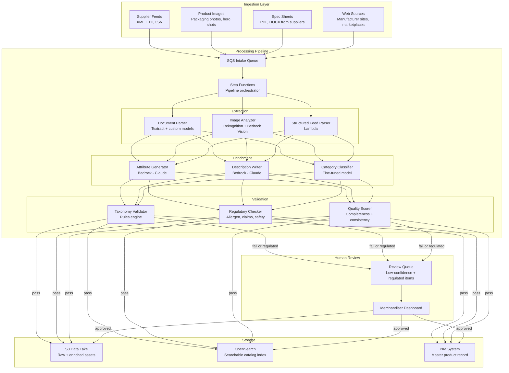
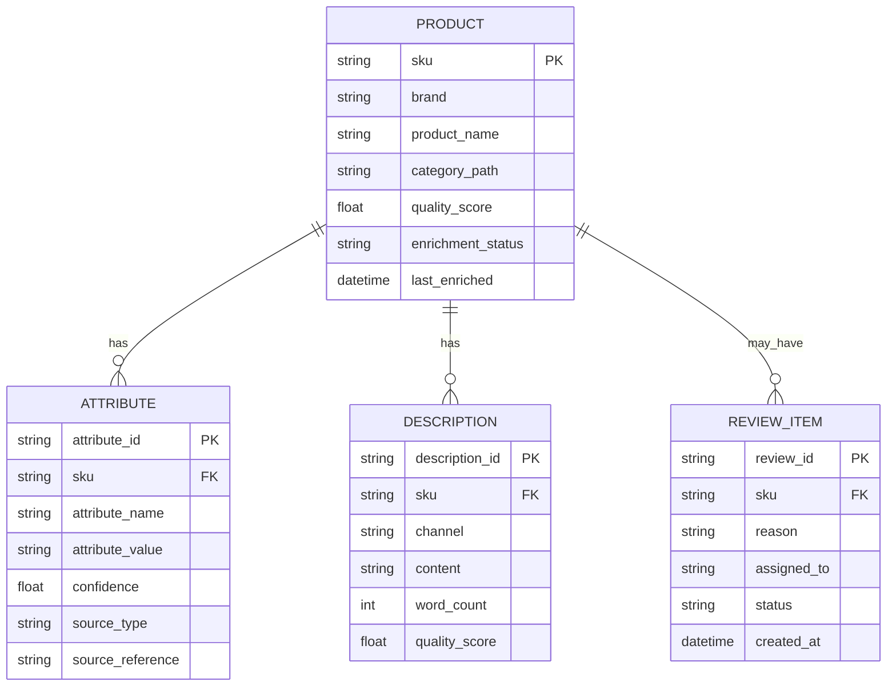
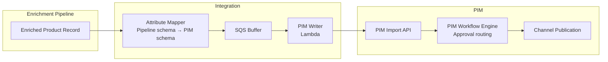

# GenAI Product Catalog Enrichment — Architecture

## System Overview



## Pipeline Stages

### Stage 1: Ingestion and Normalization

All inputs arrive as raw, unstructured data. The ingestion layer normalizes them into a standard processing envelope before entering the pipeline.

**Document processing:**
- Textract extracts text, tables, and form data from PDFs and scanned documents
- Custom post-processing handles supplier-specific layouts (ingredient panels, nutrition facts tables, spec sheet templates)
- Output: structured JSON with text blocks, tables, and confidence scores per extraction

**Image processing:**
- Product images are classified by type (front-of-pack, ingredient panel, lifestyle shot, planogram)
- Rekognition detects text in images (UPC codes, brand names, claims on packaging)
- Bedrock Vision (Claude with image input) extracts visual attributes (color, size relative to reference objects, packaging material, closure type)
- Output: structured JSON with visual attributes and confidence scores

**Structured feed processing:**
- Supplier EDI/XML feeds parsed against known schemas (GS1, 1WorldSync, proprietary)
- Missing required fields flagged
- Output: partially populated product record with gaps identified

### Stage 2: Attribute Enrichment

Foundation models fill the gaps identified in Stage 1. Each enrichment task is scoped to a specific attribute domain.

**Attribute generation prompt structure:**

```json
{
  "task": "extract_attributes",
  "product_context": {
    "brand": "Nature's Path",
    "product_name": "Organic Oat Milk Original 32oz",
    "category_path": "Beverages > Dairy Alternatives > Oat Milk",
    "known_attributes": {
      "upc": "058449000123",
      "brand": "Nature's Path",
      "size": "32 fl oz",
      "organic": true
    },
    "extracted_text": "...(from Textract)...",
    "image_attributes": "...(from vision model)..."
  },
  "target_attributes": [
    {"name": "flavor", "type": "enum", "allowed_values": ["Original", "Vanilla", "Chocolate", "Unsweetened", "Barista"]},
    {"name": "allergens", "type": "multi_enum", "allowed_values": ["Milk", "Soy", "Tree Nuts", "Wheat", "Eggs", "Peanuts", "None"]},
    {"name": "dietary_claims", "type": "multi_enum", "allowed_values": ["Vegan", "Gluten-Free", "Non-GMO", "Organic", "Kosher"]},
    {"name": "shelf_life_days", "type": "integer", "range": [1, 730]},
    {"name": "storage_temp", "type": "enum", "allowed_values": ["Ambient", "Refrigerated", "Frozen"]}
  ],
  "instructions": "Extract or infer each target attribute from the available context. If a value cannot be determined with high confidence, return null rather than guessing. For allergens and dietary claims, only assert what is explicitly stated in the source material."
}
```

**Description generation:**

Product descriptions are generated per channel, each with different constraints:

| Channel | Max Length | Tone | Required Elements |
|---|---|---|---|
| Ecommerce PDP | 300 words | Informative, consumer-friendly | Key benefits, usage occasions, dietary info |
| Marketplace listing | 150 words | SEO-optimized, scannable | Bullet-friendly, keyword-rich |
| B2B catalog | 100 words | Technical, specification-focused | Pack size, case count, shelf life, storage |
| In-store shelf tag | 25 words | Minimal, factual | Key differentiator only |

**Category classification:**

A fine-tuned classification model assigns products to the enterprise taxonomy (typically 3-5 levels deep with 2,000-10,000 leaf categories). This is not a foundation model task because:
- The taxonomy is enterprise-specific and changes quarterly
- Classification accuracy at leaf level requires domain-specific training data
- Latency requirements for batch classification favor smaller specialized models
- Fine-tuning cost is modest (typically under $500 per quarterly retrain)

### Stage 3: Validation

Every enriched attribute passes through three validation layers before reaching the master catalog.

**Taxonomy validation (deterministic rules):**
- Enum attributes must match allowed values exactly
- Numeric attributes must fall within defined ranges
- Required attribute combinations must be present (e.g., if "organic" is true, "certification_body" must not be null)
- Cross-attribute consistency checks (e.g., "vegan" and "contains milk" cannot coexist)

**Regulatory validation:**
- Allergen declarations must match against source material (no inferred allergens)
- Nutritional claims must have supporting evidence in extracted data
- Country-specific labeling requirements checked against target market
- Items failing regulatory checks route to mandatory human review regardless of confidence

**Quality scoring:**

Each enriched item receives a composite quality score:

```
quality_score = (
    completeness_weight * attribute_completeness +
    confidence_weight * avg_extraction_confidence +
    consistency_weight * cross_attribute_consistency +
    source_weight * source_corroboration_rate
)
```

Items scoring above 0.85 proceed to catalog automatically. Items between 0.60 and 0.85 enter the review queue. Items below 0.60 recycle to the extraction stage with a request for additional source material.

### Stage 4: Human Review

The review queue presents items to merchandisers with:
- The enriched product record (proposed attributes highlighted)
- Source material used for each extraction (linked to specific text spans or image regions)
- Confidence scores per attribute
- Suggested corrections when the model's secondary hypothesis differs from its primary

The merchandiser workflow is approve, edit, or reject. Edits feed back into the fine-tuning dataset for the next model improvement cycle.

## Data Model



## Cost Model

Estimated monthly cost for processing 10,000 items/month (initial enrichment) plus 2,000 items/month (updates and re-enrichments):

| Component | Monthly Cost | Notes |
|---|---|---|
| Textract | $1,200 | ~60,000 pages/month (avg 5 pages per spec sheet) |
| Bedrock (Claude Sonnet) — attributes | $3,500 | ~12,000 calls, avg 3K input + 800 output tokens |
| Bedrock (Claude Sonnet) — descriptions | $2,200 | ~48,000 calls (4 channels × 12,000 items), avg 1.5K input + 400 output tokens |
| Rekognition + Bedrock Vision | $1,800 | ~36,000 images (avg 3 per item) |
| OpenSearch | $1,600 | 3-node cluster for catalog search index |
| S3 + data transfer | $200 | Raw assets, enriched data, version history |
| Step Functions | $150 | Pipeline orchestration |
| Lambda | $300 | Parsing, validation, integration functions |
| **Total** | **$10,950/month** | |

**Cost per item:** approximately $0.91 for initial enrichment (5 attributes + 4 descriptions + validation). Ongoing re-enrichment costs less (~$0.40/item) because extraction is cached and only changed attributes regenerate.

**ROI framing:** A 1% improvement in product search conversion on a $500M ecommerce channel equals $5M annually. Catalog completeness directly correlates with search performance. Enterprises typically see 3-8% conversion improvement when attribute completeness moves from 60% to 95%.

## Integration with Existing PIM

Most enterprises run Salsify, Akeneo, Stibo STEP, or Informatica MDM as their PIM. This architecture writes enriched data back through the PIM's standard import APIs, not around them.



The attribute mapper handles schema translation between the pipeline's internal data model and the PIM's field structure. This is the only integration point that changes when the PIM platform changes.

Items enriched with high confidence (score > 0.85) can bypass the PIM's manual approval workflow and proceed directly to channel publication, if the enterprise's data governance policy permits automated publication for non-regulated categories.

## Implementation Sequence

1. **Month 1:** Structured feed parser + taxonomy validator (deterministic, no ML, proves the pipeline plumbing)
2. **Month 2:** Image analysis + attribute extraction for a single category (pick the highest-volume category)
3. **Month 3:** Description generation for one channel + quality scoring
4. **Month 4:** Multi-category expansion + human review workflow
5. **Month 5:** PIM integration + automated publication for qualifying items
6. **Month 6:** Multi-channel description generation + regulatory validation for food/beverage
