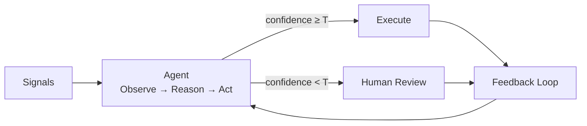
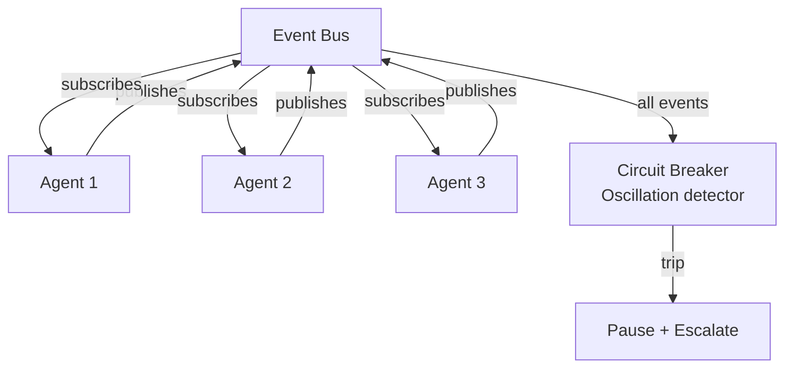
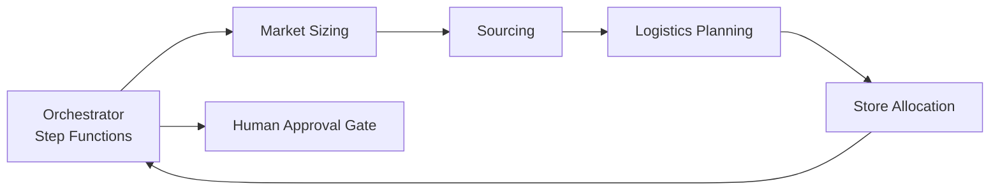

# Agentic Architecture Patterns for Supply Chain

The word "agentic" has been applied to everything from a chatbot with a tool call to a fully autonomous factory floor. This document defines what agentic means in the context of enterprise supply chain operations and catalogs the patterns that work at scale.

## Defining "Agentic" for Supply Chain

An agentic system in supply chain has four properties:

1. **Autonomous decision-making within bounds.** The system takes action without waiting for human input, provided the decision falls within pre-defined guardrails.
2. **Goal-oriented behavior.** The system pursues an objective (minimize stockouts, reduce transportation cost, maintain service levels) rather than executing a fixed script.
3. **Environmental awareness.** The system reacts to changing conditions (demand shifts, disruptions, capacity changes) without being explicitly told something changed.
4. **Coordination with other agents and humans.** The system communicates decisions, shares context, and escalates when its confidence or authority is insufficient.

A rules engine that fires when inventory drops below a threshold is not agentic. It executes a fixed response to a fixed trigger. An agent observes the same threshold breach, considers why it happened (demand spike vs. supply delay vs. data error), evaluates multiple response options, selects the most appropriate one given current constraints, and explains its reasoning.

## Pattern 1: Single-Domain Autonomous Agent

**Structure:** One agent owns one decision domain end-to-end. It observes signals, reasons about options, acts within guardrails, and escalates when uncertain.

**When to use:** The decision domain is well-bounded, the data inputs are reliable, and the consequences of a wrong decision are recoverable within hours.

**Example:** An inventory rebalancing agent that monitors stock levels across 12 DCs and initiates transfers when imbalances threaten service levels. It has authority to move up to $50K of product per day without approval.

**Failure mode:** The agent encounters a situation outside its training distribution and makes a confident-but-wrong decision. Mitigation: anomaly detection on input signals plus mandatory human review when the agent's action pattern deviates from historical norms.

## Pattern 2: Multi-Agent Event Mesh

**Structure:** Multiple specialized agents connected through an event bus. Each agent publishes decisions as events. Other agents subscribe to relevant events and incorporate them into their own reasoning.

**When to use:** The problem spans multiple decision domains that have different cadences, data requirements, and ownership boundaries. No single agent can hold sufficient context for all domains.

**Example:** The [Agentic Supply Chain Optimization](../architectures/agentic-supply-chain/architecture.md) architecture in this repo. Five agents (demand sensing, inventory allocation, procurement, logistics, disruption response) coordinate through EventBridge.

**Failure mode:** Cascading decisions. Agent A makes an adjustment, Agent B reacts to that adjustment, Agent A reacts to B's reaction, creating an oscillation loop. Mitigation: decision cooldown periods, maximum adjustment velocity limits, and a circuit-breaker pattern that pauses the mesh if aggregate decision volume exceeds historical norms by 3x.

## Pattern 3: Orchestrated Agent Pipeline

**Structure:** A central orchestrator sequences agent execution in a defined order. Each agent's output feeds into the next agent's input. The orchestrator handles error recovery and rollback.

**When to use:** Decisions have strict dependencies (B cannot execute until A completes), the overall process has a defined start and end, and the enterprise needs a clear audit trail of the decision sequence.

**Example:** New product launch planning. A market sizing agent produces demand estimates, which feed a sourcing agent that identifies suppliers, which feeds a logistics agent that plans initial distribution, which feeds an allocation agent that determines store-level quantities. Each step depends on the previous step's output.

**Failure mode:** Bottleneck at the orchestrator. If the orchestrator fails, the entire pipeline stalls. Mitigation: Step Functions with built-in retry, timeout, and dead-letter-queue semantics. Each step is idempotent so the pipeline can resume from any checkpoint.

## Pattern 4: Human-Agent Collaborative Loop

**Structure:** The agent does 80% of the work (data gathering, analysis, option generation) and presents a recommendation to a human. The human approves, modifies, or rejects. The agent learns from the human's edits over time.

**When to use:** Decisions are high-stakes, the regulatory environment requires human accountability, or the organization is not yet ready for full autonomy.

**Example:** Supplier negotiation preparation. The agent analyzes spend history, market prices, supplier performance, and contract terms. It drafts a negotiation position with target price, walk-away price, and supporting evidence. The procurement manager reviews, adjusts, and executes the negotiation personally.

**Failure mode:** The human becomes a rubber stamp. If the agent is right 98% of the time, the human stops carefully reviewing and misses the 2% that requires intervention. Mitigation: Randomly insert "challenge scenarios" where the agent intentionally presents a borderline recommendation that requires active judgment, keeping the human engaged.

## Pattern 5: Supervisor Agent with Specialist Subordinates

**Structure:** A supervisory agent decomposes complex problems into sub-tasks, delegates each to a specialist agent, collects results, and synthesizes a unified response.

**When to use:** Problems are complex and require multiple types of reasoning (quantitative analysis, unstructured text interpretation, domain-specific rule application) that no single model prompt can handle well.

**Example:** Root cause analysis for a service level miss. The supervisor agent receives an alert that fill rate dropped below target. It delegates: one specialist checks demand forecast accuracy, another checks inventory data quality, a third checks logistics execution, a fourth checks supplier delivery performance. The supervisor synthesizes findings into a unified root cause assessment with confidence-weighted attribution.

**Failure mode:** The supervisor loses context when aggregating specialist outputs, producing a summary that misses nuance. Mitigation: Specialists return structured findings with evidence pointers. The supervisor cites specific specialist evidence in its synthesis, and the full specialist outputs remain available for human review.

## Choosing the Right Pattern

| Factor | Single-Domain | Event Mesh | Pipeline | Collaborative | Supervisor |
|---|---|---|---|---|---|
| Decision independence | High | High | Low (sequential) | Medium | Low (decomposed) |
| Coordination complexity | None | High | Medium | Low | Medium |
| Human involvement | Escalation only | Escalation only | Gate-based | Every decision | Review synthesized output |
| Failure blast radius | Small (one domain) | Medium (cascading risk) | Medium (pipeline stall) | Small (human catches errors) | Small (supervisor validates) |
| Implementation complexity | Low | High | Medium | Low | Medium |
| Best starting point | Yes | No (build after Pattern 1 proven) | Yes (for sequential processes) | Yes (for high-stakes decisions) | No (requires mature specialist agents) |

## Implementation Guidance

Start with Pattern 1 (single-domain) or Pattern 4 (collaborative) depending on the organization's risk tolerance. These patterns have the smallest blast radius and the shortest path to demonstrating value.

Graduate to Pattern 2 (event mesh) only after at least two single-domain agents are running in production and the team has built confidence in guardrail calibration, monitoring, and incident response procedures.

Pattern 5 (supervisor) is an advanced pattern that requires mature specialist agents as building blocks. Attempting it before the specialists are individually proven introduces too many failure points to debug simultaneously.

## Related

- [Agentic Supply Chain Optimization Architecture](../architectures/agentic-supply-chain/architecture.md)
- [Why Retail & CPG Companies Struggle with AI Adoption](why-retail-cpg-struggles-with-ai.md)
- [From POC to Production: What Actually Changes](from-poc-to-production-ai.md)
